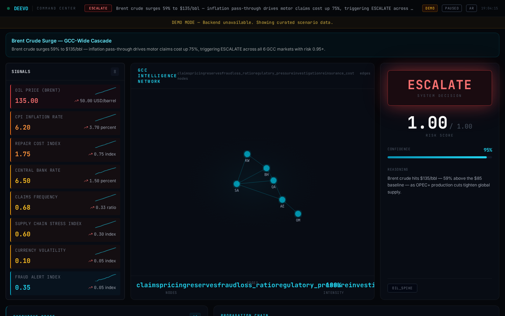

<div align="center">

# DEEVO Decision Intelligence

### Transform signals → graph → decisions.

**AI Decision Intelligence System for GCC.**

[](https://github.com/PyBADR/deevo-cortex)
[](LICENSE)
[](https://vercel.com/new/clone?repository-url=https://github.com/PyBADR/deevo-cortex)

*by Bader Alabddan*

</div>

---

## Live Demo

[**Open Command Center**](https://deevo-cortex.vercel.app/command-center)



---

## What This Is

DEEVO is a decision intelligence system designed for GCC markets.

It ingests signals, builds relationships, and produces actionable decisions.

This is NOT a dashboard.
This is NOT a demo.

**This is a decision system.**

---

## Example

Oil hits $110.

System output:

```
→ Inflation ↑
→ Claims ↑
→ Fraud risk ↑
```

Decision: **ESCALATE**

Confidence: 0.87 | Risk Score: 0.82

The system traces the causal chain, simulates propagation across 6 GCC countries, and outputs a decision with full reasoning — in under 2 seconds.

---

## Architecture

```
Signals → Graph → Rules → Simulation → Decision → Output
```

```
┌─────────────────────────────────────────────────────┐
│ 7. API & UI          REST endpoints, Command Center │
├─────────────────────────────────────────────────────┤
│ 6. Executive Layer   Briefings, Recommendations     │
├─────────────────────────────────────────────────────┤
│ 5. Decision Logic    Risk rules, Threshold engine   │
├─────────────────────────────────────────────────────┤
│ 4. Propagation       Causal effect simulation       │
├─────────────────────────────────────────────────────┤
│ 3. Causal Graph      Signal relationships           │
├─────────────────────────────────────────────────────┤
│ 2. Signal Processing Normalization, Context         │
├─────────────────────────────────────────────────────┤
│ 1. Data Ingestion    Real-time GCC market signals   │
└─────────────────────────────────────────────────────┘
```

---

## Focus

- **GCC Markets** — Saudi Arabia, UAE, Kuwait, Qatar, Bahrain, Oman
- **Insurance Intelligence** — Claims, fraud, underwriting, reserves
- **Risk Modeling** — Causal graphs, propagation chains, scenario simulation
- **Economic Signals** — Oil, inflation, supply chain, regulatory, geopolitical

---

## Stack

| Layer | Technology |
|-------|-----------|
| Frontend | React + Vite + TypeScript + Tailwind |
| Visualization | SVG network graph, Sparkline charts |
| Backend | FastAPI + PostgreSQL + LangGraph |
| AI | Ollama (local), GPT-4 (cloud) |
| Deployment | Vercel (frontend), Docker (backend) |

---

## Run Locally

```bash
cd frontend
npm install
npm run dev
```

Opens at `http://localhost:5173` in demo mode — no backend required.

For full stack:

```bash
pip install -r requirements.txt
python run.py          # Backend on :8000
cd frontend && npm run dev  # Frontend on :5173
```

---

## Demo Scenarios

| Scenario | Decision | Market |
|----------|----------|--------|
| Oil Price Spike | ESCALATE | GCC-wide |
| Fraud Surge | ESCALATE | All countries |
| Supply Chain Break | REVIEW | Trade exposure |
| Repair Cost Inflation | REVIEW | All countries |
| Geopolitical Escalation | ESCALATE | GCC-wide |

All scenarios use real engine output — not mock data.

---

## Deploy

[](https://vercel.com/new/clone?repository-url=https://github.com/PyBADR/deevo-cortex)

Set `VITE_API_BASE_URL` to connect a backend. Leave empty for demo mode.

See [SELF_HOSTING.md](SELF_HOSTING.md) for Docker and Mac M4 Max + Ollama setup.

---

## License

MIT — see [LICENSE](LICENSE)

---

<div align="center">

**Built by [Bader Alabddan](https://github.com/PyBADR)**

Star this repo to follow development.

</div>
